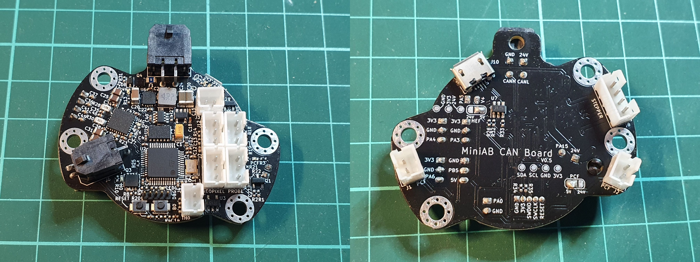
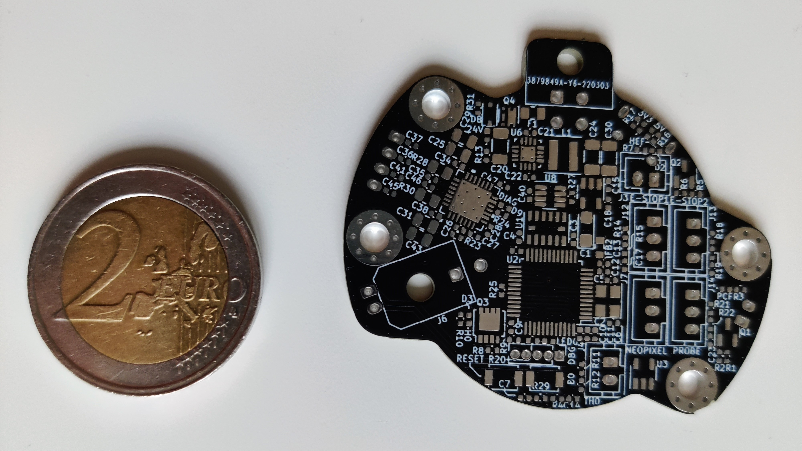
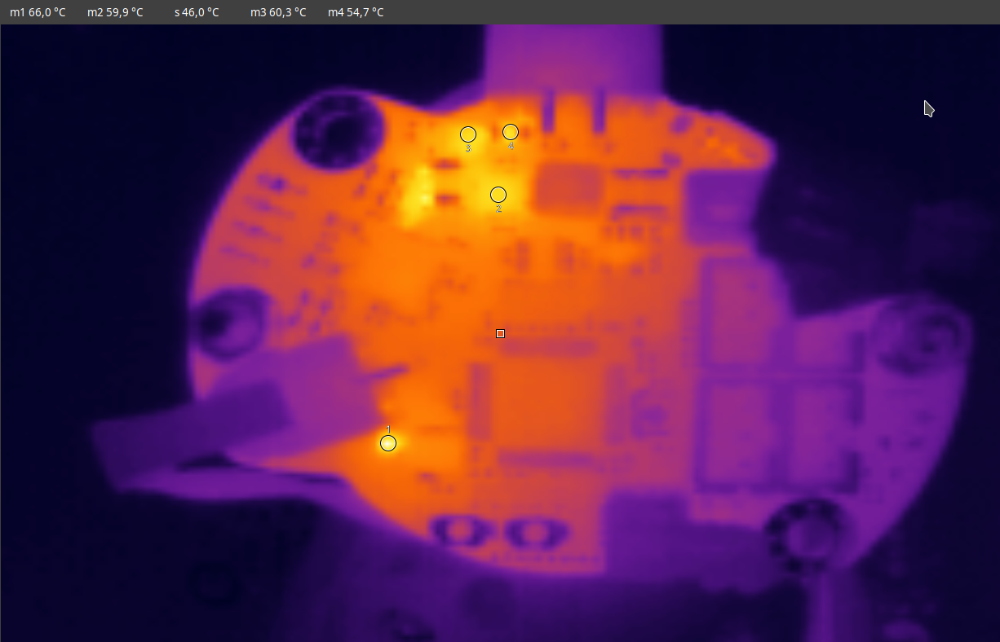
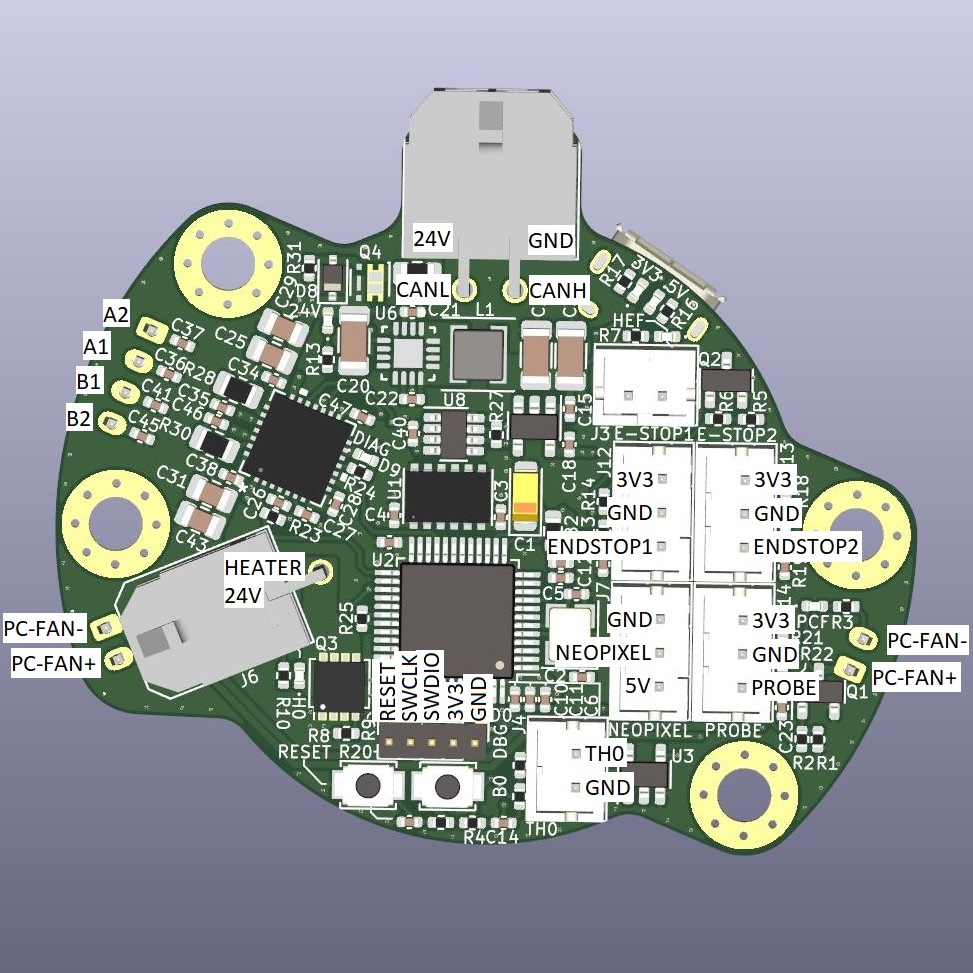

# MiniAB-CAN
Toolhead board with CAN interface for [Voron Mini Afterburner](https://github.com/VoronDesign/Voron-0) and [Voron Stealthburner](https://github.com/VoronDesign/Voron-Afterburner/tree/sb-beta).

Features:
- CAN bus interface
- TMC2209 stepper driver for extruder motor
- Integrated ADXL345 for resonance compensation
- Neopixel Output for toolhead LEDs
- Two endstop and one probe port
- User-selectable fan voltages (5V/24V)

---

## Table of Contents
- [Prototype](#prototype)
  - [Size comparison](#size)
  - [Thermal images](#thermal-images)
- [Pinout](#pinout)
- [Interactive BOM](https://finn2708.github.io/MiniAB-CAN/)

## Prototype

### Size

### Thermal images

## Pinout

